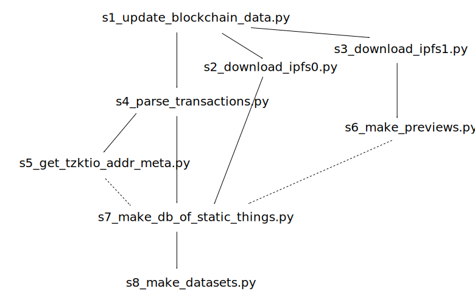

# How to update dataset and read the source

Note, that the code is still experimental, and it is not expected to be able to run "out of the box". Most probably you will get errors, which will require substantial modification of source code.

## Design principles

In general, dataset should be able to update itself fully automatically.

However, in case if any unexpected transactions occur (as a result of new hicetnunc features or deployment of external contracts) the exception will be thrown, so  the source code should be modified.

There are lots of redundant assertions in the source code designed to catch any types of previously unseen behaviour and to double check internal consistency. Sometimes it is sufficient just to comment such failed assertion, and the code will work correctly.

## Please, read this section before running commands

In order to get full dataset from scratch, it will take probably >24 hours and 140 Gb of traffic and disk space. 

It is not rare, that TzStats and Cloudflare temporarily ban parsers if they operate continuously during long period of time.

So, please, download cache directory from "Releases" section of the GitHub repository and put them in appropriate location on your disk.

## Files structure

* `/cache` &mdash; all intermediate data
    * `/cache/accounts_metadata` &mdash; http://tzkt.io/ accounts metadata cache
    * `/cache/ipfs0` &mdash; all IPFS entries, mentioned in the blockchain. All tokens JSON metadata is stored here.
    * `/cache/ipfs0` &mdash; all IPFS entries, mentioned in `ipfs0` entries. All images are stored here.
    * `/cache/parsed_transactions` &mdash; all data extracted from transactions.
    * `/cache/transactions` &mdash; all http://tzstats.com/ transactions related to hicetnunc grouped by timestamp.
    * `/cache/previews` &mdash; tokens thumbnails
* `/dataset` &mdash; final data
* `/scripts` &mdash; python scripts to update cache and dataset
* `/src` &mdash; python modules used by scripts and jupyter notebooks
* `/jupyter` &mdash; [Jupyter notebooks](https://jupyter.org/)

## Scripts data dependencies



Dashed lines represent optional dependencies.

## Thumbnail server

Note, that it is required to start [fpurchess/preview-service](https://hub.docker.com/r/fpurchess/preview-service) thumbnail server on port 8000. Follow the instructions on docker hub page, and try to mount optional volumes, if there are permission errors.

## By running python script

The dataset can be updated automatically by running

```
python3 scripts/0_run_all.py
```

It is recommended to use python3.6 or above. 

Repository root directory should be called `hicetnunc-dataset`.

You can re-run individual stages by calling corresponding script.

## By running Docker image

Docker is not recommended, since in case of errors it is not easy to modify the code.

You should mount `/hicetnunc-dataset/cache` to some directory (replace `...` in command below) on your computer to make cache persistent. This directory should be prepopulated with cache contents from the "Releases" section of this repository.

Also, it may be necessary to increase RAM limit. It is proportional to the number of transactions being parsed and now is about 3 Gb.

```
docker build -t hicetnunc_dataset .
docker run -it --memory="5g" --mount type=bind,source=...,target=/hicetnunc-dataset/cache hicetnunc_dataset
```
